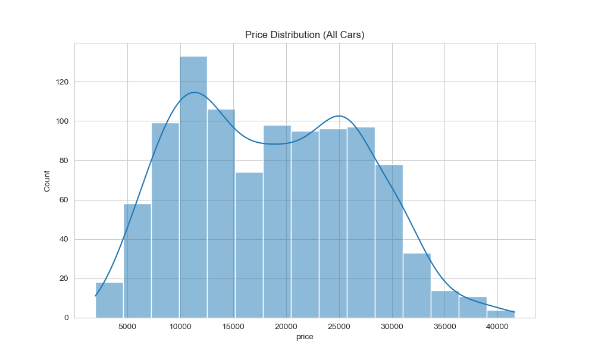
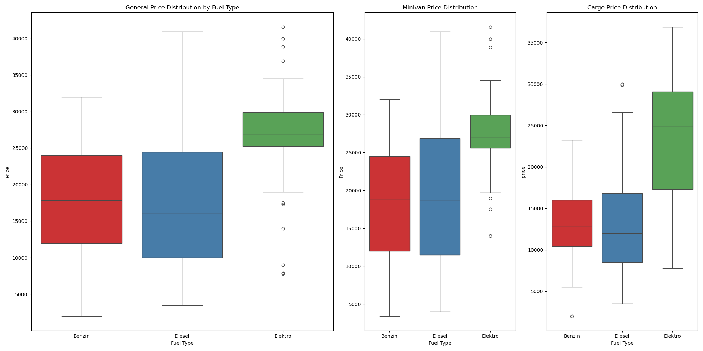
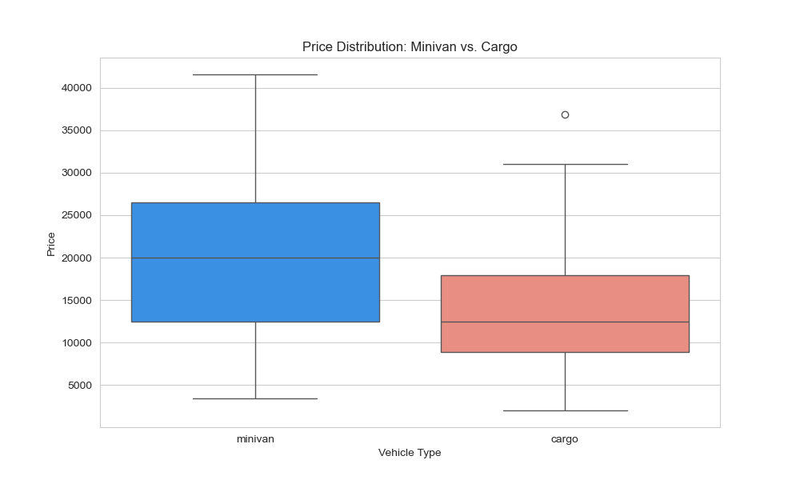
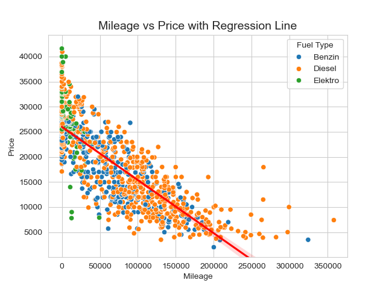
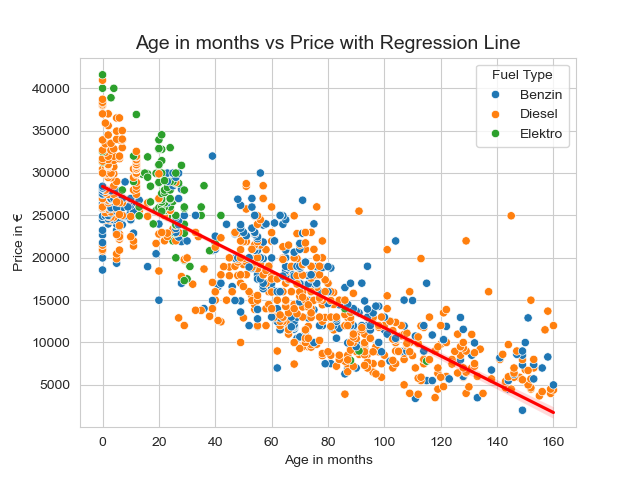

# Citroën Berlingo Germany Price Analysis  
**Goal**: Identify factors influencing used Berlingo prices in Germany (2012–2025).  


  

## 📂 Repository Structure  
```plaintext
berlingo-germany-price-analysis/  
├── data/  
│   ├── raw/                   # Original scraped CSVs  
│   └── cleaned/               # Processed data (berlingo_cleaned_final.csv)  
├── output/                    # Visualizations  
│   ├── price_distribution.png  
│   ├── mileage_vs_price_fuel.png  
│   └── ...  
├── draft/
    ├── berlingo_price_analysis_draft.ipynb     # Jupyter Notebook with analysis Draft

├── berlingo_price_analysis.ipynb               # Jupyter Notebook with full analysis  
├── autoscout_data_cleaning.ipynb               # Data cleaning steps  
├── README.md                                   # This file  
└── presentation.pdf                            # Final slides 
```

## 🔍 Key Insights  

### 1. **Diesel vs. Petrol Pricing vs Electric **  
- **Diesel cars** show a **wider price range** compared to Petrol, especially in minivans.  
- **Mean price**:  
  - Diesel: €17,601.87  
  - Petrol: €17,844.77

- **Why the spread?** Diesel minivans vary more in features and mileage.  


<!--    -->

---

### 2. **Minivan vs. Cargo Prices**  
- **Minivans (family)** are priced **~45% higher** on average than cargo models.  
- Example:  
  - Minivan: €19,885.95  
  - Cargo: €13,674.00  

  

---

### 3. **Mileage & Age Impact**  
- **Age** and **Mileage** have similar strong negative correlation with price. Beeing age (`r = -0.85`) stronger than Mileage (`r = -0.81`).  
- Cars with **< 50,000 km** cost **225% more** than those with > 150,000 km.  

  
  

---

### 4. **Electric Vehicles (Elektro)**  
- **Limited listings**, but priced higher (€26,985.36 avg) despite older models.  
- **CO2 emissions**: 0 g/km (validated for Elektro).  

---

## 🛠 Tools Used  
- Python (Pandas, Seaborn, Matplotlib)  
- Jupyter Notebook  

---

## 🔗 Data Sources  
- **Autoscout24**: Scraped listings for Citroën Berlingo (2012–2025) in Germany.

